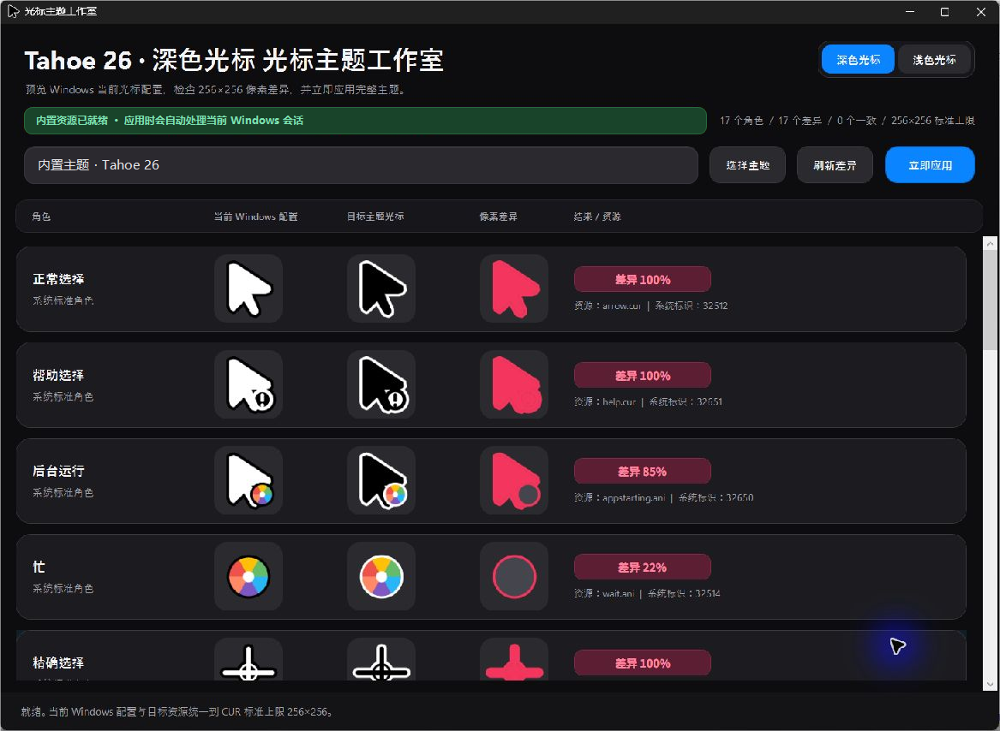
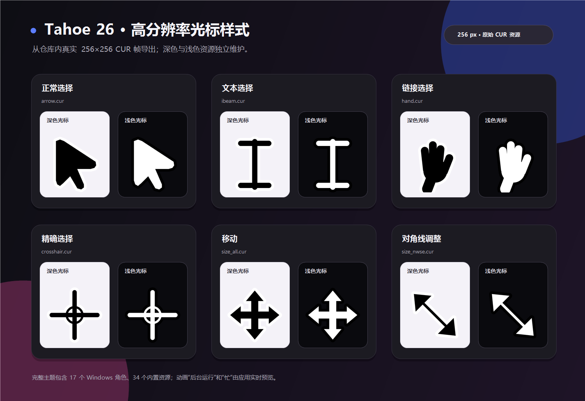
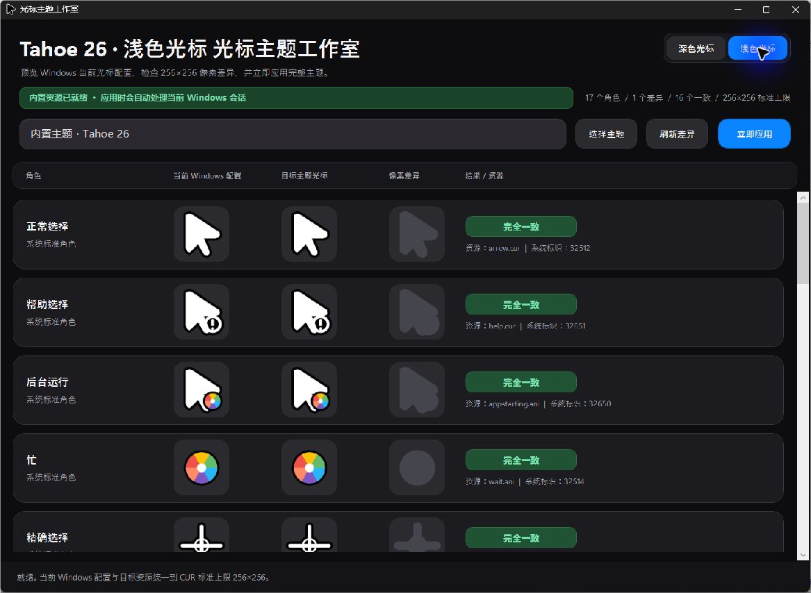

# Tahoe 26 Windows 光标主题工作室

> 原创的深浅双色 Windows 光标主题与原生 WPF 管理工具，提供 256 像素预览、像素差异对比和一键应用。

[](https://github.com/y4Nkk/tahoe26-windows-cursors/actions/workflows/ci.yml)
[查看最新自动构建](https://github.com/y4Nkk/tahoe26-windows-cursors/releases/tag/latest)

<p align="center">
  
</p>

<p align="center">
  <sub>实机截图：原生 Windows 11 标题栏、深色方案、三列 256×256 预览与像素差异结果。</sub>
</p>

`Tahoe 26 Windows 光标主题工作室` 是面向 Windows 11 的原创光标主题和原生桌面应用。视觉语言受 macOS Tahoe 26 启发，但本项目**不包含、不提取、不再分发任何 Apple 光标文件或 Apple 系统资源**。

## 实机界面与光标展示

<p align="center">
  
</p>

上图直接从仓库内的真实 **256×256 CUR 帧**导出，展示深色与浅色两套独立资源；不是网页图标、低分辨率放大图或概念图。完整主题包含 17 个 Windows 角色、34 个内置资源，其中 15 个静态 CUR 和 2 个动画 ANI。

| 深色方案：差异预览 | 浅色方案：应用后一致预览 |
| --- | --- |
|  |  |

展示图仅用于说明界面与资源结构。主题目录使用通用的“内置主题 · Tahoe 26”文案；不包含账户名、绝对路径、设备标识或特定系统构建信息。

## 获取最新自动构建

每次推送到 `main` 后，GitHub 会自动完成发布、资源自检和 SHA-256 计算；只有全部步骤成功，才会自动创建或覆盖滚动预发布 [`latest`](https://github.com/y4Nkk/tahoe26-windows-cursors/releases/tag/latest)。无需手动从 Actions 下载临时 Artifact。

`latest` 始终指向最新一次验证通过的提交，提供以下下载内容：

```text
TahoeCursorStudio.exe
SHA256SUMS.txt
SelfTestReport.json
```

它是持续更新的自动预发布，不取代以后固定的 `v1.0.0`、`v1.0.1` 等正式语义版本；需要长期引用时，应使用对应的正式 Release。

## 仓库信息

GitHub 仓库：[`y4Nkk/tahoe26-windows-cursors`](https://github.com/y4Nkk/tahoe26-windows-cursors)。以下是仓库页面可使用的中文信息：

| 项目 | 推荐值 |
|---|---|
| 仓库名 | `tahoe26-windows-cursors` |
| 仓库标题 | Tahoe 26 Windows 光标主题工作室 |
| 仓库简介 | 原创的深浅双色 Windows 光标主题与原生 WPF 管理工具，提供 256 像素预览、像素差异对比和一键应用。 |
| 默认分支 | `main` |
| 推荐标签 | `windows`、`windows-11`、`cursor-theme`、`cursor`、`wpf`、`dotnet`、`desktop-app`、`dpi-aware` |
| 正式版本标签 | `v1.0.0`、`v1.0.1` 这类 `v主版本.次版本.修订版本` 格式 |

仓库名保留英文和短横线，是为了让 GitHub URL、命令行、Release 下载链接保持稳定；其他用户可见内容均使用中文。

## 成品下载与安装

本地发布版位于：

```text
dist\TahoeCursorStudio.exe
```

日常测试与最新使用请从 [`latest` 自动预发布](https://github.com/y4Nkk/tahoe26-windows-cursors/releases/tag/latest) 下载；创建正式发行版后，则从仓库的 **Releases（发行版）** 页面选择相应的 `v主版本.次版本.修订版本`。不要从源码页下载未经过发布验证的文件。

首次使用：

1. 双击 `TahoeCursorStudio.exe`。
2. 在右上角选择“深色光标”或“浅色光标”。
3. 检查全部 17 个角色的“当前 Windows 配置”“目标主题光标”和“像素差异”。
4. 点击“立即应用”。

应用自身会把当前选择持久化为 Windows 光标方案。若需要稳定的开始菜单和桌面入口，可执行：

```powershell
& '.\dist\TahoeCursorStudio.exe' --install
```

安装后的位置和快捷方式：

```text
%LOCALAPPDATA%\Programs\TahoeCursorStudio\TahoeCursorStudio.exe
桌面\Tahoe 26 光标主题工作室.lnk
开始菜单\Tahoe 26 光标主题工作室.lnk
```

卸载时运行：

```powershell
& "$env:LOCALAPPDATA\Programs\TahoeCursorStudio\TahoeCursorStudio.exe" --uninstall
```

卸载会恢复应用安装前备份的当前用户光标配置，并删除本应用创建的快捷方式、当前用户卸载项和应用资源目录。

## 核心特性

- 使用 **WPF / .NET 8** 编写的原生 Windows 桌面程序；不依赖 PowerShell、WinForms、React、Node.js、浏览器运行时或 WebView。
- 发布为 `win-x64` 自包含单文件 EXE；普通使用者无需另外安装 .NET 运行时。
- 使用 **Windows 11 原生深色标题栏**、原生最小化/最大化/关闭按钮、系统窗口阴影和窗口拖拽；内容区采用简洁、圆角、深色的 Apple 风格设计。
- 使用 Per-Monitor V2 DPI 感知，适配多显示器和高缩放比例。
- 提供深色、浅色两种独立命名的 Windows 光标方案。
- 覆盖全部 **17 个 Windows 光标角色**：正常选择、帮助选择、后台运行、忙、精确选择、文本选择、手写、不可用、各方向调整大小、移动、候选选择、链接选择、位置选择、人员选择。
- 提供三列 256×256 预览：当前 Windows 配置、目标主题资源、像素差异图。
- 支持一键应用、当前用户持久化、桌面快捷方式、开始菜单快捷方式和卸载恢复。

## 分辨率与 DPI 标准

静态 CUR 资源统一封装以下十级尺寸：

```text
32、40、48、56、64、80、96、112、128、256 像素
```

其中 **256×256** 是 CUR 单帧可用的标准高分辨率上限。应用内预览、像素差异和资源验证统一以 256×256 为准，不会把 64×64 光标简单放大后伪装成高分辨率资源。

每一套外观都包含 17 个角色，共 34 个内置资源；其中 15 个静态 CUR 与 2 个动画 ANI。

## Windows 11 光标重新加载问题

在部分 Windows 11 环境中，标准光标重新加载接口可能返回失败，或返回无法按角色绘制的共享系统句柄。

本应用的处理顺序是：

1. 把所选方案持久写入当前用户的 Windows 光标注册表。
2. 请求 Windows 标准光标重新加载。
3. 如果重新加载失败，直接修复当前会话中的公开系统光标句柄。
4. 如果共享句柄无法逐角色渲染，预览明确显示“当前 Windows 配置”的已登记资源，而不是把空图误报为“完全一致”。

`NWPen`（手写）没有 Windows 公开的 `SetSystemCursor` 系统标识，因此该角色按 Windows 的公开接口能力通过注册表方案持久应用；其他 16 个公开系统角色可在需要时直接修复当前会话。

## 命令行自检与应用

发布 EXE 内置无界面自检，不需要 PowerShell 脚本来生成或安装光标：

```powershell
$程序 = '.\dist\TahoeCursorStudio.exe'

# 验证清单、深浅外观、全部资源、256 像素加载和 CUR 尺寸表
& $程序 --self-test '.\自检报告.json' --quiet

# 应用深色或浅色主题，并输出结果报告
& $程序 --apply dark '.\应用报告.json' --quiet
& $程序 --apply light '.\应用报告.json' --quiet
```

`--apply` 只接受 `dark` 或 `light`；不会接受旧版单主题参数、旧 schema 或 PowerShell 兼容入口。

## 主题格式

主题清单为根目录的 `cursor-theme.json`，使用严格的 **schema v2**：

- 必须且只能声明 `dark` 与 `light` 两个外观。
- 每个角色必须具有唯一的 Windows 注册表名称和资源文件名。
- 不接受未知字段、schema v1、旧单主题结构或过渡兼容字段。

内置资源会展开到：

```text
%LOCALAPPDATA%\TahoeCursorStudio\Themes\Tahoe26
```

实际应用的光标方案会保存到：

```text
%LOCALAPPDATA%\TahoeCursorStudio\Schemes\dark
%LOCALAPPDATA%\TahoeCursorStudio\Schemes\light
```

## 从源码发布

开发环境要求：Windows x64 与 .NET 8 SDK。仓库中的 `global.json` 固定 .NET 8 SDK 基线，允许自动使用同一大版本的更新功能带 SDK。

```powershell
dotnet publish .\src\TahoeCursorStudio\TahoeCursorStudio.csproj `
  --configuration Release `
  --runtime win-x64 `
  --self-contained true `
  --output .\dist
```

发布结束后建议执行：

```powershell
& '.\dist\TahoeCursorStudio.exe' --self-test '.\自检报告.json' --quiet
```

## GitHub 自动构建与发布

仓库已包含两个 GitHub Actions 工作流：

| 文件 | 触发时机 | 作用 |
|---|---|---|
| `.github/workflows/ci.yml` | 推送到 `main`、创建/更新 Pull Request、手动运行 | 在 Windows Runner 上发布单文件 EXE，执行内置自检，上传临时 Artifact；当 `main` 的构建成功时，自动更新 `latest` 预发布并上传 EXE、SHA-256 和自检报告。 |
| `.github/workflows/release.yml` | 推送 `v主版本.次版本.修订版本` 标签，或手动输入标签 | 发布带版本号的 EXE，执行自检，生成 SHA-256 校验和，并创建 GitHub Release。 |

持续集成会验证：

- WPF 项目是否可编译和发布；
- schema v2 是否有效；
- 深色和浅色资源是否完整；
- 是否仍有 17 个角色、34 个资源；
- 所有资源是否能按 256×256 加载；
- 静态 CUR 是否仍保留十级尺寸表。

创建正式发行版的典型流程：

```powershell
git tag v1.0.0
git push origin v1.0.0
```

标签推送后，GitHub 会自动创建名为 `v1.0.0` 的 Release，并附带：

```text
TahoeCursorStudio.exe
SHA256SUMS.txt
SelfTestReport.json
```

Release 中的 `SelfTestReport.json` 与临时 Artifact 中的 `自检报告.json` 内容相同；公开下载使用 ASCII 文件名，以保证 GitHub Release 资产名称在不同客户端中稳定显示。

`dist/` 已加入 `.gitignore`：本地保留发布 EXE 方便直接运行，GitHub 仓库只保存源码、资源和构建配置；正式 EXE 只通过 GitHub Release 交付。

## GitHub 仓库与后续推送

当前仓库已经初始化为 Git，并已推送到 `main`：

```text
https://github.com/y4Nkk/tahoe26-windows-cursors.git
```

后续提交新内容的常规流程：

```powershell
git add .
git commit -m "说明本次改动"
git push origin main
```

首次公开发布前，请确认本项目中全部光标图形均为你拥有发布权的原创资源。当前仓库未附带许可证；若要公开开源，建议在确认代码和美术资源的授权方式后，再添加适合的许可证文件。

## 目录说明

```text
Cursors/                         深色和浅色 CUR / ANI 源资源
src/TahoeCursorStudio/           原生 WPF 应用源码
.github/workflows/               GitHub 自动构建与正式发布工作流
docs/images/                     README 使用的实机界面截图与 256 像素光标展示图
cursor-theme.json                严格 schema v2 光标主题清单
global.json                      .NET SDK 基线
```

## 已知边界

- 某些应用会自行绘制或替换鼠标指针；这类应用级指针不受 Windows 全局光标方案控制。
- `NWPen` 没有 Windows 公开的当前会话替换系统 ID，应用通过持久方案处理它。
- 本项目只支持 Windows x64 发布目标。
